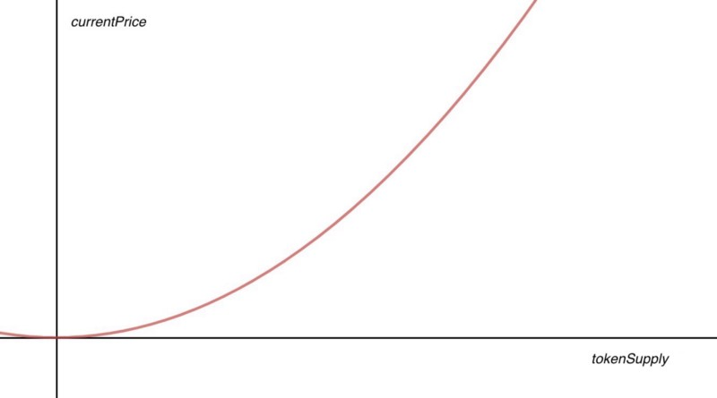

# Crypto Loyalty Currency Models

A new crop of loyalty startups are combining loyalty points programs and cryptocurrencies. Some with a platform play, some with a currency play, and all with interesting choices ahead of them. Here we overview the range of currency models along with their respective implications.

## Peer to Peer

Peer to peer (p2p) transfers are one of the unique features of crypto based loyalty points. There is no central point of reconciliation, no expiry, and no restrictions on who you can transfer to.

That said, consider how and when the "free for all" begins. Are points freely transferable immediately? Does a threshold have to be met before they are redeemed? Freely transferable also means there is no control over whether or not they are traded on secondary markets; see [Gans, Joshua S. and Halaburda, Hanna, Some Economics of Private Digital Currency (July 23, 2013)](https://papers.ssrn.com/sol3/papers.cfm?abstract_id=2297296).

**Advice:** While blockchain platforms enable p2p out of the box, smart contracts allow finer grained control than _p2p on_ / _p2p off_. Your business needs, or regulatory compliance needs, may count on creating a more sophisticated transfer model.

## Points Value

Here's where crypto & loyalty intersecting sinks or swims. We outline below three common models and highlight related flaws and benefits.

### Floating Value

Perhaps an artifact of the 2017 funding boom, many startups are pitching new loyalty currencies whose value floats up and down based on their respective performance on secondary markets.

While, perhaps, appealing to speculators, this model is unpalatable for consumers. Shoppers and points program members collect points over time expecting to later redeem for something valuable. Seeing points earned lose value, or even opening up this a possibility, is simply a disaster for loyalty programs.

**Advice 1:** If you really do want to offer a speculative reward as part of your program, consider offering speculative assets as something members can _redeem points for_. Forcing members to collect in floating value speculative rewards is going to hurt more than it helps.

**Advice 2:** Just don't.

### Pegged Value

Traditional points programs are pegged in value, e.g. 10 points add up to $1 or 100 points add up to $1.  Countless successful proprietary and coalition programs use this model: over time members earn points which translate to a fixed dollar amount (e.g. 1 cent or 10 cents a point), redeemable at select partners.

Crypto based loyalty currencies can not only follow suit by pegging their value, they can leverage existing blockchain ecosystems to go further. With a variety of stable tokens already on the market (i.e. tokenized USD algorithmically backed like DAI or deposit backed like TUSD), it is possible to issue reward tokens with pre-funded USD inside of each token.

Think of these tokens as similar to Russian nesting dolls where each loyalty token can be opened to reveal an amount in dollars. Once the token is opened, these dollars can be spent anywhere dollars are accepted.

**Advice 1:** Those seriously considering combining the benefits of crypto currencies with loyalty points should begin here. This approach introduces the p2p and immutable record keeping benefits of blockchain while sparing program members from loss of value on secondary markets.

**Advice 2:** If it is truly important to introduce loyalty members to non-pegged digital assets, consider pegging your loyalty points to an established digital currency such as Bitcoin or Ethereum. Similar to the USD peg, reward recipients can crack open your token to reveal a fixed amount of Ether; negating the need to introduce a new and unique currency to secondary markets.

### Bonded Curve tokens

Pegged currencies are not a universal fit for everyone's needs. So what can be done to offer the potential of increased value while avoiding headaches that go along with a floating value currency?

Rather than letting token value float based on speculative markets, this model pegs the value to a curve. In other words, pegged token value is no longer a constant such as `1 point = 1 cent`, token value is now a function `value = f(tokenSuply)`.

_Image Source: [Slava Balasanov; Bonding Curves for Continuous Token Models](https://blog.relevant.community/how-to-make-bonding-curves-for-continuous-token-models-3784653f8b17)_

The more tokens issued, the higher the price per token. In a sense, this model is a hybrid approach with elements of both the **Floating** and the **Pegged** value models.

**Advice:** Be aware

## Piloting or launching a new program?

At Tag Loyalty we'd love to continue the conversation. We have expertise in design and development of basic and sophisticated token models. [Reach out to us for a free consultation](https://www.tagloyalty.com/contact/).
